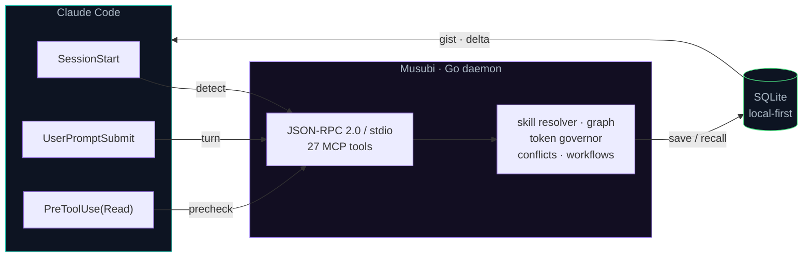
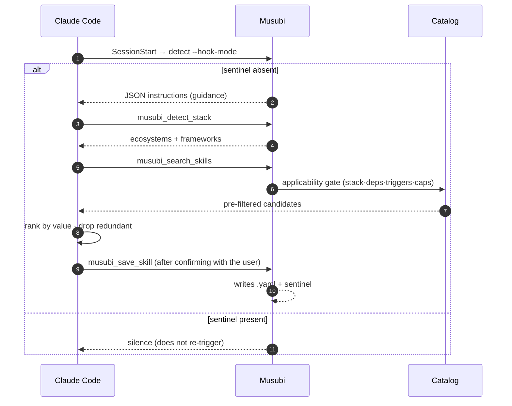
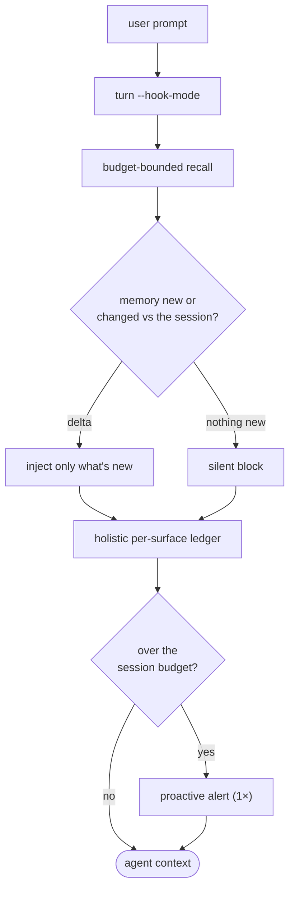

<div align="center">



<h1>Musubi</h1>

<p><strong>Persistent memory for AI agents · MCP server in Go · local-first · model-free</strong></p>

[](https://github.com/codeabraham16/musubi/actions/workflows/ci.yml)
[](https://github.com/codeabraham16/musubi/releases)
[](LICENSE)
[](go.mod)
[](CHANGELOG.md)

<strong>English</strong> · <a href="README.md">Español</a>

</div>

**Musubi** is an **MCP (Model Context Protocol)** server written in Go that gives an AI agent
**persistent, token-efficient memory**. It stores what a project learns —decisions, conventions,
bugs, code gists—, retrieves it by keyword, semantic similarity or knowledge graph, and injects
into the agent **only what's relevant and only what's new** on each turn.

Everything runs **local-first**: memory lives in a SQLite database inside `.musubi/`, with no
mandatory external services. The core is **model-free**: it runs no inference and spends no money —
token optimization, ranking and skill resolution are deterministic and offline.

---

## Table of contents

- [Why Musubi](#why-musubi)
- [Architecture](#architecture)
- [Quick start](#quick-start)
- [Installation](#installation)
- [How it works](#how-it-works)
- [Capabilities](#capabilities)
  - [Memory and retrieval](#memory-and-retrieval)
  - [Token governor](#token-governor)
  - [Skills: project + marketplace](#skills-project--marketplace)
  - [Workflow orchestration](#workflow-orchestration)
- [MCP tools](#mcp-tools)
- [Configuration](#configuration)
- [CLI reference](#cli-reference)
- [Semantic search (embeddings)](#semantic-search-embeddings)
- [Development](#development)
- [Status and roadmap](#status-and-roadmap)
- [Documentation](#documentation)

---

## Why Musubi

| | |
|---|---|
| 🧠 **Persistent memory** | Observations, facts (graph) and code gists that survive across sessions, in local SQLite. |
| 🔎 **Hybrid retrieval** | Full-text (FTS5), semantic similarity (IVF vector index at scale) and graph traversal — combinable. |
| 🪙 **Token-efficient** | Session governor: it measures **every** surface it injects, bounds them by budget, and injects by **delta** (only what's new). Model-free. |
| 🛠️ **Automatic skills** | Detects the stack and generates project skills; discovers community Agent Skills filtered by your stack. |
| 🔗 **Model-free orchestration** | Resumable DAG workflow engine (conditions, loops) and a multi-agent blackboard — Musubi sequences, the agent executes. |
| 🔒 **Local-first & private** | No mandatory external services. Optional embeddings (local Ollama or OpenAI-compatible). The secret never touches the YAML. |
| ⚙️ **Zero friction** | One command (`musubi setup`) makes any project ready: workspace, MCP and hooks. Idempotent. |

---

## Architecture



Three hooks feed the daemon; the daemon speaks MCP and persists everything to SQLite. What flows
back to the agent (code gist, per-turn context) is **measured** and injected as a **delta** — only
what's new relative to the previous turn.

---

## Quick start

```bash
cd my-project
musubi setup        # inject Musubi into the project (workspace + MCP + hooks)
```

Reopen the project in your agent (Claude Code) and the `musubi_*` tools become available.
`setup` is idempotent: it respects existing `.mcp.json`, skills, `.gitignore` and
`.claude/settings.json`. Don't have the binary yet? See [Installation](#installation).

---

## Installation

The installer lets you **choose the scope**:

- **Local to the repo** — the binary lives in `<repo>/.musubi/bin/`, `.mcp.json` points there and
  **your PATH and machine are untouched**. Delete `.musubi/` and no trace remains. Ideal for trying
  it out without "infecting" your machine.
- **Global** — the binary goes to the user PATH (no admin) and exposes `MUSUBI_BIN`; then you run
  `musubi setup` in any other repo. This is "ecosystem" mode: every project resolves the binary even
  if its path changes.

### Double-click (Windows, no terminal)

Download **`Musubi.exe`** from the [latest release](https://github.com/codeabraham16/musubi/releases)
and **double-click** it. A menu asks `[L]` local or `[G]` global and sets everything up.

### One-liner (interactive: asks local/global)

```powershell
# Windows (PowerShell)
irm -useb https://raw.githubusercontent.com/codeabraham16/musubi/main/scripts/install.ps1 | iex
```

```bash
# Linux / macOS
curl -fsSL https://raw.githubusercontent.com/codeabraham16/musubi/main/scripts/install.sh | bash
```

Non-interactive (pick the scope via a variable):

```powershell
$env:MUSUBI_SCOPE='global'; irm -useb .../scripts/install.ps1 | iex   # or 'local'
```
```bash
curl -fsSL .../scripts/install.sh | MUSUBI_SCOPE=local bash           # or global
```

Installer variables: `MUSUBI_SCOPE` (local|global), `MUSUBI_DIR` (project folder),
`MUSUBI_NOSETUP=1` (don't run setup), `MUSUBI_BINARY` (use an already-downloaded binary).

> **Private repo:** for the anonymous download to work, releases must be public. If the repo is
> private, install [gh CLI](https://cli.github.com) and authenticate (`gh auth login`) — the
> installer uses it as a fallback.

### From source

```bash
go build -o musubi ./cmd/musubi
```

---

## How it works

`musubi setup` makes the project ready end to end:

- Creates the `.musubi/` workspace (config + database).
- Writes the starter **cognitive skills** into `.musubi/skills/` and the **SDD templates**
  (proposal, spec, design, tasks) into `.musubi/templates/sdd/`.
- Generates/merges `.mcp.json` so the agent **loads the `musubi` server automatically**.
- Injects three **hooks** into `.claude/settings.json` (Claude Code) and protects the DB via `.gitignore`.

| Agent | MCP config | Hooks |
|--------|-----------|-------|
| `claude` (default) | `.mcp.json` | SessionStart · UserPromptSubmit · PreToolUse(Read) |
| `cursor` | `.cursor/mcp.json` | — (Cursor has no hook system) |

```bash
musubi setup --agent cursor
```

### Skill auto-discovery

The first time you open the project, Musubi detects the stack and guides the generation of custom
skills without you writing YAML by hand.



The `SessionStart` hook runs `musubi detect --hook-mode`. If the sentinel
`.musubi/skills/.skills-generated` doesn't exist, it emits instructions for the agent to detect the
stack, query the curated catalog (pre-filtered by technical relevance), research the **official**
documentation, **confirm the rules with you** and save each skill with `musubi_save_skill`. From
then on the hook stays silent. To regenerate: delete the sentinel and reopen the project.

---

## Capabilities

### Memory and retrieval

- **Observations** (`musubi_save_observation`) — prose with a `topic_key`; indexed for FTS5 and,
  if embeddings are on, for semantic search.
- **Hybrid retrieval** — `musubi_recall` (token-budgeted), `musubi_search_keyword` (FTS5, always
  available), `musubi_search_semantic` (similarity; requires embeddings).
- **Knowledge graph** — facts as triples (`musubi_save_fact`), per-entity traversal
  (`musubi_recall_facts`) and a graph↔prose bridge (`musubi_entity_context`). Recalling facts costs
  far fewer tokens than recalling prose.
- **Code memory** — save a gist + symbols of a file (`musubi_save_code`) so you **don't re-read it
  whole** later; the `PreToolUse(Read)` hook surfaces it automatically before you read.
- **Automatic maintenance** — near-duplicate consolidation and salience-based forgetting
  (`musubi_maintain`), with database self-healing (`musubi_doctor`).
- **At scale** — semantic search uses an **IVF** vector index that trains itself above a volume
  threshold; below it, exact full-scan.

### Token governor

Musubi **measures and bounds** how much context it injects. The whole core is automatic, local and offline.



- **Holistic ledger** — the server accounts for **every** surface it injects (startup priming,
  per-turn recall, pipeline phase, conflicts, code memory and PreToolUse telemetry, hydration,
  skill generation…), not just one. *You can't optimize what you don't measure.*
- **Session budget** — a soft ceiling (`memory.session_token_budget`, default `8000`; `0` disables
  it). `musubi_tokens` reports total, remaining, % used, **status** (`ok` < 75 % · `watch` ≥ 75 % ·
  `over` ≥ 100 %) and the **per-surface breakdown**.
- **Output brevity** *(opt-in)* — `memory.brevity_mode` injects a directive so the agent answers
  **concisely**, trimming **output** tokens (everything else only bounds the **input**). `off`
  (default) does nothing; `lite`/`full`/`ultra` set the level once per session; `auto` only fires
  when spend crosses `session_token_budget` (zero cost below it). It always **preserves exactly**
  code, commands, paths, versions and flags.
- **Differential injection (delta)** — per turn it injects only the memory/phase/conflicts **new or
  changed** relative to the session, instead of repeating everything each turn. Cache-considerate.
- **Content-type estimator** — classifies text (prose / code / JSON) with calibrated divisors;
  optionally tunable with `musubi calibrate` (free, opt-in, see below).

Inspect real spend with the `musubi_tokens` tool (`action: status | reset`).

### Skills: project + marketplace

Two complementary layers:

- **Project skills** (`.musubi/skills/*.yaml`) — local rules the resolver activates based on the
  files in play (triggers + capabilities). Generated during auto-discovery.
- **Curated catalog** (`musubi_search_skills`) — candidates pre-filtered by a **hard applicability
  gate** (stack · deps · triggers · capabilities) from the central catalog.
- **Agent Skills marketplace** (`musubi_discover_skills`) — discovers community `SKILL.md` skills
  (≈1.7 M indexed) **filtered by your stack**. Reads from a harvested static catalog (zero rate
  limit) with a live-API fallback. It's **discovery only**: it returns metadata and the GitHub link
  for you to review and install yourself — Musubi **never** downloads, runs or installs the
  `SKILL.md`.

### Workflow orchestration

Musubi coordinates a **DAG of steps without executing them**: you define the graph, Musubi tells you
what's ready and **remembers progress across sessions** (state in SQLite, resumable).

```yaml
# .musubi/workflows/feature.yaml
id: feature
schema_version: "1.0"
steps:
  - id: explore
  - id: implement
    needs: [explore]
  - id: docs
    needs: [explore]
  - id: verify
    needs: [implement, docs]
```

`musubi_workflow action=start … workflow=feature` → returns the ready steps; you execute and call
`action=complete step=…` → returns the newly-ready ones; and so on until `done`. `action=resume`
picks up a run in another session.

- **Flow control (`when`)** — a step with a model-free condition is skipped if it's false
  (gate / if-then / switch). Operators: `==`, `!=`, `contains`, `and`, `or`, `not`, parentheses;
  references `step.<id>.status` / `step.<id>.result`.
- **Loops (`repeat_while` + `max_iterations`)** — a step is re-offered while the condition holds,
  with a safety cap.

For parallel work, the **multi-agent** blackboard (`musubi_work`) hands out units to sub-agents and
consolidates, and the **phase pipeline** (`musubi_phase`) sequences
explore → plan → code → verify, reminding the agent of the phase each turn.

---

## MCP tools

The server exposes **27 tools**, grouped by domain:

| Domain | Tools |
|---------|--------------|
| **Memory** | `musubi_save_observation` · `musubi_recall` · `musubi_memory_expand` · `musubi_search_keyword` · `musubi_search_semantic` |
| **Knowledge graph** | `musubi_save_fact` · `musubi_recall_facts` · `musubi_entity_context` |
| **Code memory** | `musubi_save_code` · `musubi_recall_code` |
| **Tokens** | `musubi_tokens` (ledger + session governor) |
| **Skills** | `musubi_detect_stack` · `musubi_search_skills` · `musubi_save_skill` · `musubi_resolve_skills` · `musubi_log_skill_decision` · `musubi_discover_skills` (marketplace) |
| **Telemetry & health** | `musubi_log_error` · `musubi_resolve_telemetry` · `musubi_doctor` · `musubi_maintain` · `musubi_insights` |
| **Memory conflicts** | `musubi_conflicts` · `musubi_judge` |
| **Orchestration** | `musubi_workflow` (DAG) · `musubi_work` (multi-agent) · `musubi_phase` (pipeline) |

---

## Configuration

The workspace is configured in `.musubi/config.yaml` (generated by `musubi setup`/`init` with sane
defaults). Main blocks:

```yaml
version: "1.0"
mode: local
skills_auto_resolve: true

embedding:
  provider: none            # none | ollama | openai (-compatible)
  model: nomic-embed-text
  base_url: http://localhost:11434
  dimensions: 768
  api_key_env: OPENAI_API_KEY   # name of the env var; the secret NEVER goes in the yaml

memory:
  recall_token_budget: 400      # default ceiling for musubi_recall
  gist_max_tokens: 24           # cap of a gist (extractive headline)
  candidate_pool: 50            # candidates to rank before packing
  session_token_budget: 8000    # soft ceiling of the governor (0 = no ceiling)
  brevity_mode: off             # concise-output directive: off|lite|full|ultra|auto
                                #   auto = only when crossing session_token_budget (needs ceiling > 0)

loop:
  per_turn_recall: true         # inject relevant context per turn
  recall_budget: 250
  delta_injection: true         # inject only what's new/changed (cache-considerate)
  surface_conflicts: true
  capture_reminder: true

sourcing:
  enabled: true
  catalog_url: https://raw.githubusercontent.com/codeabraham16/musubi-skills/main/index.json
  marketplace_enabled: false    # opt-in: discovery of external Agent Skills
```

> The curated catalog and the harvested marketplace catalog live in the
> [`musubi-skills`](https://github.com/codeabraham16/musubi-skills) repo; that's why sourcing works
> without you maintaining a local index. Point `catalog_url` at your own repo to curate your own.

Other available blocks (with defaults): `maintenance` (consolidation + forgetting + retention),
`graph`, `conflicts`, `pipeline`, `multiagent`, `vector_index` (IVF index), `startup`, `update`
and `service` (opt-in HTTP transport, loopback only).

---

## CLI reference

```
Installation
  setup [--agent <claude|cursor>]   Inject Musubi into the project (workspace + MCP + hooks)
  init                              Initialize just the .musubi/ workspace (config + DB)

MCP server
  daemon                            MCP server over stdin/stdout (used by the agent)
  serve [--addr host:port]          MCP server over HTTP (opt-in; loopback only)

Memory
  maintain                          Merge near-duplicates and archive cold memories
  doctor                            Diagnose/repair the memory database
  export [--out <path>]             Dump a JSON snapshot (health + tokens + graph) for dashboards
  dashboard [--addr ...] [--no-open] Live local memory UI (read-only · loopback · 0 tokens)
  calibrate [--apply]               (opt-in) Tune the token estimator (requires ANTHROPIC_API_KEY)

Skill catalog
  catalog validate                  Validate a catalog index.json
  catalog merge <url>               Fetch and merge a remote catalog
  catalog harvest                   Harvest a static catalog from the marketplace

Binary
  update                            Download the latest release, verify checksum and self-replace
  version                           Show the binary version
```

`musubi daemon` speaks JSON-RPC 2.0 over stdin/stdout and honors `MUSUBI_HOME` to pin the workspace
(by default, the project directory via `CLAUDE_PROJECT_DIR`).

---

## Semantic search (embeddings)

Semantic search is **optional**. With `provider: none` (default), `musubi_search_semantic` responds
with an explicit error suggesting keyword search; everything else works.

| Provider | How |
|----------|------|
| `ollama` | Local, no API key. `ollama pull nomic-embed-text` and set `embedding.provider: ollama`. The server calls `POST {base_url}/api/embeddings`. |
| `openai` | The OpenAI API **or any compatible server** (LM Studio, vLLM, LocalAI, Together…). `export OPENAI_API_KEY=…`, adjust `model`/`dimensions` and point `base_url`. |

Agents always pass **text**, never vectors. The API key is read from the env var named in
`api_key_env` and is **never stored in the YAML**.

### `musubi calibrate` — free and optional

The token estimator ships with factory-calibrated divisors. If you want to tune them to your corpus,
`musubi calibrate` measures them against Anthropic's **`count_tokens` endpoint**, which is **not
billed** (it counts tokens, it doesn't generate text). It's opt-in (requires `ANTHROPIC_API_KEY`),
one-time (`--apply` persists the divisors) and the **only** part of Musubi that talks to Anthropic
over the network. **The MCP server never calls the API**: it stays 100 % offline and model-free.

---

## Development

```bash
go build -o musubi ./cmd/musubi   # compile
go test ./...                     # full suite
go test -race ./...               # with the race detector (as in CI)
```

```
cmd/musubi/        # CLI + hooks: setup, init, detect, turn, precheck, daemon, doctor, update…
internal/
  bootstrap/       # injection: MergeMCPServer + MergeClaudeSettings (hooks)
  config/          # config.yaml loading + per-block defaults
  detector/        # DetectStack + ExtractDeps (manifests, mtime cache)
  embedding/       # Provider: Ollama + OpenAI-compatible + Noop
  logx/            # structured logging to stderr
  mcp/             # JSON-RPC 2.0 server + the 27 MCP tools
  memory/          # SQLite: observations, FTS5, embeddings, graph, IVF index,
                   #   telemetry, code memory, token ledger, workflows
  selfupdate/      # `musubi update`: download + checksum + self-replace
  skills/          # dynamic skill resolver (triggers + capabilities)
  skillsource/     # curated catalog + marketplace (fetch, applicability gate, harvest)
```

Conventions, CI checks and the release flow in [CONTRIBUTING.en.md](CONTRIBUTING.en.md).

---

## Status and roadmap

Mature core covered by tests (`-race` in CI). Already implemented and hardened: hybrid memory,
knowledge graph, code memory, IVF vector index at scale, token governor, skill auto-discovery,
Agent Skills marketplace, DAG workflow engine, multi-agent blackboard and phase pipeline.

Deliberately deferred (with the groundwork already in place):

- **Hot-patch self-correction loop** (telemetry → automatic patch → retry). Today the telemetry
  logging and resolution exist, surfaced proactively before editing a file.
- **Binary code signing** (removing the SmartScreen warning on Windows).

---

## Documentation

- [CHANGELOG.md](CHANGELOG.md) — version history (Keep a Changelog).
- [CONTRIBUTING.en.md](CONTRIBUTING.en.md) — dev setup, CI checks, conventions and release.
- [docs/MCP_SDK_Evaluation.md](docs/MCP_SDK_Evaluation.md) — why the server hand-rolls JSON-RPC.
- [docs/Roadmap_spec-kit_adoption.md](docs/Roadmap_spec-kit_adoption.md) — DAG orchestration, multi-agent and SDD templates.
- [LICENSE](LICENSE) — MIT.
