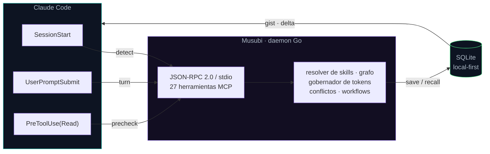
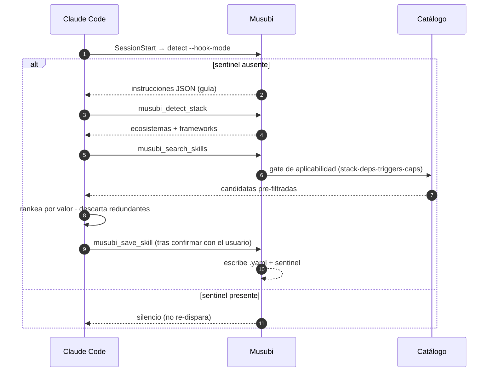
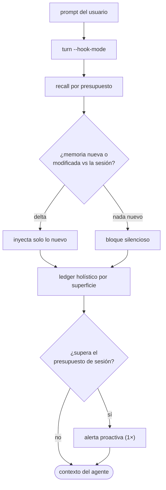

<div align="center">


<h1>Musubi</h1>

<p><strong>Memoria persistente para agentes de IA · servidor MCP en Go · local-first · model-free</strong></p>

[](https://github.com/codeabraham16/musubi/actions/workflows/ci.yml)
[](https://github.com/codeabraham16/musubi/releases)
[](LICENSE)
[](go.mod)
[](CHANGELOG.md)

</div>

**Musubi** es un servidor **MCP (Model Context Protocol)** escrito en Go que le da a un agente de IA
una **memoria persistente y eficiente en tokens**. Guarda lo que el proyecto aprende —decisiones,
convenciones, bugs, gists de código—, lo recupera por palabra clave, similitud semántica o grafo de
conocimiento, y le inyecta al agente **solo lo relevante y solo lo nuevo** en cada turno.

Todo corre **local-first**: la memoria vive en una base SQLite dentro de `.musubi/`, sin servicios
externos obligatorios. El núcleo es **model-free**: no hace inferencia ni gasta dinero — la
optimización de tokens, el ranking y la resolución de skills son deterministas y offline.

---

## Tabla de contenidos

- [Por qué Musubi](#por-qué-musubi)
- [Arquitectura](#arquitectura)
- [Inicio rápido](#inicio-rápido)
- [Instalación](#instalación)
- [Cómo funciona](#cómo-funciona)
- [Capacidades](#capacidades)
  - [Memoria y recuperación](#memoria-y-recuperación)
  - [Gobernador de tokens](#gobernador-de-tokens)
  - [Skills: proyecto + marketplace](#skills-proyecto--marketplace)
  - [Orquestación de workflows](#orquestación-de-workflows)
- [Herramientas MCP](#herramientas-mcp)
- [Configuración](#configuración)
- [Referencia de CLI](#referencia-de-cli)
- [Búsqueda semántica (embeddings)](#búsqueda-semántica-embeddings)
- [Desarrollo](#desarrollo)
- [Estado y roadmap](#estado-y-roadmap)
- [Documentación](#documentación)

---

## Por qué Musubi

| | |
|---|---|
| 🧠 **Memoria persistente** | Observaciones, hechos (grafo) y gists de código que sobreviven entre sesiones, en SQLite local. |
| 🔎 **Recuperación híbrida** | Texto completo (FTS5), similitud semántica (índice vectorial IVF a escala) y recorrido de grafo — combinables. |
| 🪙 **Eficiente en tokens** | Gobernador de sesión: mide **todas** las superficies que inyecta, las acota por presupuesto e inyecta por **delta** (solo lo nuevo). Model-free. |
| 🛠️ **Skills automáticas** | Detecta el stack y genera skills del proyecto; descubre Agent Skills de la comunidad filtradas por tu stack. |
| 🔗 **Orquestación model-free** | Motor de workflows DAG resumible (condiciones, loops) y pizarra multi-agente — Musubi secuencia, el agente ejecuta. |
| 🔒 **Local-first & privado** | Sin servicios externos obligatorios. Embeddings opcionales (Ollama local u OpenAI-compatible). El secreto nunca toca el YAML. |
| ⚙️ **Cero fricción** | Un comando (`musubi setup`) deja cualquier proyecto listo: workspace, MCP y hooks. Idempotente. |

---

## Arquitectura



Tres hooks alimentan al daemon; el daemon habla MCP y persiste todo en SQLite. Lo que vuelve al
agente (gist de código, contexto por turno) se **mide** y se inyecta como **delta** — solo lo nuevo
respecto del turno anterior.

---

## Inicio rápido

```bash
cd mi-proyecto
musubi setup        # inyecta Musubi en el proyecto (workspace + MCP + hooks)
```

Reabrí el proyecto en tu agente (Claude Code) y las herramientas `musubi_*` quedan disponibles.
`setup` es idempotente: respeta `.mcp.json`, skills, `.gitignore` y `.claude/settings.json`
existentes. ¿Todavía no tenés el binario? Ver [Instalación](#instalación).

---

## Instalación

El instalador te deja **elegir el alcance**:

- **Local al repo** — el binario queda en `<repo>/.musubi/bin/`, el `.mcp.json` apunta ahí y
  **no se toca el PATH ni la PC**. Borrás `.musubi/` y no queda rastro. Ideal para probar sin
  "infectar" la máquina.
- **Global** — el binario va al PATH del usuario (sin admin) y se expone `MUSUBI_BIN`; después
  usás `musubi setup` en cualquier otro repo. Es el modo "ecosistema": todos los proyectos
  resuelven el binario aunque cambie la ruta.

### Doble clic (Windows, sin terminal)

Descargá **`Musubi.exe`** de la [última release](https://github.com/codeabraham16/musubi/releases)
y hacé **doble clic**. Un menú te pregunta `[L]` local o `[G]` global y deja todo listo.

### Una línea (interactivo: pregunta local/global)

```powershell
# Windows (PowerShell)
irm -useb https://raw.githubusercontent.com/codeabraham16/musubi/main/scripts/install.ps1 | iex
```

```bash
# Linux / macOS
curl -fsSL https://raw.githubusercontent.com/codeabraham16/musubi/main/scripts/install.sh | bash
```

No interactivo (elegís el alcance por variable):

```powershell
$env:MUSUBI_SCOPE='global'; irm -useb .../scripts/install.ps1 | iex   # o 'local'
```
```bash
curl -fsSL .../scripts/install.sh | MUSUBI_SCOPE=local bash           # o global
```

Variables del instalador: `MUSUBI_SCOPE` (local|global), `MUSUBI_DIR` (carpeta del proyecto),
`MUSUBI_NOSETUP=1` (no correr setup), `MUSUBI_BINARY` (usar un binario ya descargado).

> **Repo privado:** para que la descarga anónima funcione, las releases deben ser públicas. Si el
> repo es privado, instalá [gh CLI](https://cli.github.com) y autenticate (`gh auth login`) — el
> instalador lo usa como fallback.

### Desde fuente

```bash
go build -o musubi ./cmd/musubi
```

---

## Cómo funciona

`musubi setup` deja el proyecto listo de punta a punta:

- Crea el workspace `.musubi/` (config + base de datos).
- Escribe las **skills cognitivas** de arranque en `.musubi/skills/` y los **templates SDD**
  (proposal, spec, design, tasks) en `.musubi/templates/sdd/`.
- Genera/mergea `.mcp.json` para que el agente **cargue el servidor `musubi` automáticamente**.
- Inyecta tres **hooks** en `.claude/settings.json` (Claude Code) y protege la base en `.gitignore`.

| Agente | Config MCP | Hooks |
|--------|-----------|-------|
| `claude` (default) | `.mcp.json` | SessionStart · UserPromptSubmit · PreToolUse(Read) |
| `cursor` | `.cursor/mcp.json` | — (Cursor no tiene sistema de hooks) |

```bash
musubi setup --agent cursor
```

### Auto-descubrimiento de skills

Al abrir el proyecto por primera vez, Musubi detecta el stack y guía la generación de skills
personalizadas sin que escribas YAML a mano.



El hook `SessionStart` corre `musubi detect --hook-mode`. Si el sentinel
`.musubi/skills/.skills-generated` no existe, emite instrucciones para que el agente detecte el
stack, consulte el catálogo curado (pre-filtrado por relevancia técnica), investigue la
documentación **oficial**, **confirme las reglas con vos** y guarde cada skill con
`musubi_save_skill`. A partir de ahí el hook queda en silencio. Para regenerar: borrar el sentinel
y reabrir el proyecto.

---

## Capacidades

### Memoria y recuperación

- **Observaciones** (`musubi_save_observation`) — prosa con `topic_key`; se indexan para FTS5 y,
  si hay embeddings, para búsqueda semántica.
- **Recuperación híbrida** — `musubi_recall` (por presupuesto de tokens), `musubi_search_keyword`
  (FTS5, siempre disponible), `musubi_search_semantic` (similitud; requiere embeddings).
- **Grafo de conocimiento** — hechos como tripletas (`musubi_save_fact`), recorrido por entidad
  (`musubi_recall_facts`) y puente grafo↔prosa (`musubi_entity_context`). Recuperar hechos cuesta
  muchísimos menos tokens que recuperar prosa.
- **Memoria de código** — guardá un gist + símbolos de un archivo (`musubi_save_code`) para **no
  re-leerlo entero** después; el hook `PreToolUse(Read)` lo surface automáticamente antes de leer.
- **Mantenimiento automático** — consolidación de casi-duplicados y olvido por saliencia
  (`musubi_maintain`), con auto-curación de la base (`musubi_doctor`).
- **A escala** — la búsqueda semántica usa un índice vectorial **IVF** que se entrena solo por
  encima de un umbral de volumen; debajo, full-scan exacto.

### Gobernador de tokens

Musubi **mide y acota** cuánto contexto inyecta. Todo el núcleo es automático, local y offline.



- **Ledger holístico** — el server contabiliza **todas** las superficies que inyecta (priming de
  arranque, recall por turno, fase del pipeline, conflictos, memoria de código y telemetría del
  PreToolUse, hidratación, generación de skills…), no solo una. *No podés optimizar lo que no medís.*
- **Presupuesto de sesión** — un techo blando (`memory.session_token_budget`, default `8000`;
  `0` lo desactiva). `musubi_tokens` reporta total, restante, % usado, **estado**
  (`ok` < 75 % · `watch` ≥ 75 % · `over` ≥ 100 %) y el **desglose por superficie**.
- **Inyección diferencial (delta)** — por turno se inyecta solo la memoria/fase/conflictos **nuevos
  o modificados** respecto de la sesión, en vez de repetir todo cada turno. Cache-considerate.
- **Estimador por tipo de contenido** — clasifica el texto (prosa / código / JSON) con divisores
  calibrados; opcionalmente afinables con `musubi calibrate` (gratis, opt-in, ver abajo).

Inspeccioná el gasto real con la herramienta `musubi_tokens` (`action: status | reset`).

### Skills: proyecto + marketplace

Dos capas complementarias:

- **Skills del proyecto** (`.musubi/skills/*.yaml`) — reglas locales que el resolver activa según
  los archivos en juego (triggers + capabilities). Se generan en el auto-descubrimiento.
- **Catálogo curado** (`musubi_search_skills`) — candidatas pre-filtradas por un **gate de
  aplicabilidad duro** (stack · deps · triggers · capabilities) desde el catálogo central.
- **Marketplace de Agent Skills** (`musubi_discover_skills`) — descubre skills `SKILL.md` de la
  comunidad (≈1.7 M indexadas) **filtradas por tu stack**. Lee de un catálogo estático cosechado
  (cero rate limit) con fallback a la API en vivo. Es **solo de descubrimiento**: devuelve metadatos
  y el enlace de GitHub para que los revises e instales por tu cuenta — Musubi **nunca** baja,
  ejecuta ni instala el `SKILL.md`.

### Orquestación de workflows

Musubi coordina un **DAG de pasos sin ejecutarlos**: vos definís el grafo, Musubi te dice qué está
listo y **recuerda el progreso entre sesiones** (estado en SQLite, resumible).

```yaml
# .musubi/workflows/feature.yaml
id: feature
schema_version: "1.0"
steps:
  - id: explore
  - id: implement
    needs: [explore]
  - id: docs
    needs: [explore]
  - id: verify
    needs: [implement, docs]
```

`musubi_workflow action=start … workflow=feature` → devuelve los steps listos; ejecutás y hacés
`action=complete step=…` → devuelve los nuevos listos; y así hasta `done`. `action=resume` retoma
un run en otra sesión.

- **Control de flujo (`when`)** — un step con una condición model-free se salta si es falsa
  (gate / if-then / switch). Operadores: `==`, `!=`, `contains`, `and`, `or`, `not`, paréntesis;
  referencias `step.<id>.status` / `step.<id>.result`.
- **Loops (`repeat_while` + `max_iterations`)** — un step se re-ofrece mientras la condición sea
  verdadera, con cota de seguridad.

Para trabajo paralelo, la pizarra **multi-agente** (`musubi_work`) reparte unidades entre
sub-agentes y consolida, y el **pipeline por fases** (`musubi_phase`) secuencia
explorar → planear → codear → verificar recordándole la fase al agente cada turno.

---

## Herramientas MCP

El servidor expone **27 herramientas**, agrupadas por dominio:

| Dominio | Herramientas |
|---------|--------------|
| **Memoria** | `musubi_save_observation` · `musubi_recall` · `musubi_memory_expand` · `musubi_search_keyword` · `musubi_search_semantic` |
| **Grafo de conocimiento** | `musubi_save_fact` · `musubi_recall_facts` · `musubi_entity_context` |
| **Memoria de código** | `musubi_save_code` · `musubi_recall_code` |
| **Tokens** | `musubi_tokens` (ledger + gobernador de sesión) |
| **Skills** | `musubi_detect_stack` · `musubi_search_skills` · `musubi_save_skill` · `musubi_resolve_skills` · `musubi_log_skill_decision` · `musubi_discover_skills` (marketplace) |
| **Telemetría y salud** | `musubi_log_error` · `musubi_resolve_telemetry` · `musubi_doctor` · `musubi_maintain` · `musubi_insights` |
| **Conflictos de memoria** | `musubi_conflicts` · `musubi_judge` |
| **Orquestación** | `musubi_workflow` (DAG) · `musubi_work` (multi-agente) · `musubi_phase` (pipeline) |

---

## Configuración

El workspace se configura en `.musubi/config.yaml` (lo genera `musubi setup`/`init` con defaults
sensatos). Bloques principales:

```yaml
version: "1.0"
mode: local
skills_auto_resolve: true

embedding:
  provider: none            # none | ollama | openai (-compatible)
  model: nomic-embed-text
  base_url: http://localhost:11434
  dimensions: 768
  api_key_env: OPENAI_API_KEY   # nombre de la env var; el secreto NUNCA va en el yaml

memory:
  recall_token_budget: 400      # techo por defecto de musubi_recall
  gist_max_tokens: 24           # tope de un gist (titular extractivo)
  candidate_pool: 50            # candidatos a rankear antes de empaquetar
  session_token_budget: 8000    # techo blando del gobernador (0 = sin techo)

loop:
  per_turn_recall: true         # inyectar contexto relevante por turno
  recall_budget: 250
  delta_injection: true         # inyectar solo lo nuevo/modificado (cache-considerate)
  surface_conflicts: true
  capture_reminder: true

sourcing:
  enabled: true
  catalog_url: https://raw.githubusercontent.com/codeabraham16/musubi-skills/main/index.json
  marketplace_enabled: false    # opt-in: descubrimiento de Agent Skills externas
```

> El catálogo curado y el catálogo cosechado del marketplace viven en el repo
> [`musubi-skills`](https://github.com/codeabraham16/musubi-skills); por eso el sourcing funciona
> sin que mantengas un índice local. Apuntá `catalog_url` a tu propio repo para curar el tuyo.

Otros bloques disponibles (con defaults): `maintenance` (consolidación + olvido + retención),
`graph`, `conflicts`, `pipeline`, `multiagent`, `vector_index` (índice IVF), `startup`, `update`
y `service` (transporte HTTP opt-in, solo loopback).

---

## Referencia de CLI

```
Instalación
  setup [--agent <claude|cursor>]   Inyecta Musubi en el proyecto (workspace + MCP + hooks)
  init                              Inicializa solo el workspace .musubi/ (config + DB)

Servidor MCP
  daemon                            Servidor MCP sobre stdin/stdout (lo usa el agente)
  serve [--addr host:port]          Servidor MCP sobre HTTP (opt-in; solo loopback)

Memoria
  maintain                          Fusiona casi-duplicados y archiva memorias frías
  doctor                            Diagnostica/repara la base de memoria
  calibrate [--apply]               (opt-in) Afina el estimador de tokens (requiere ANTHROPIC_API_KEY)

Catálogo de skills
  catalog validate                  Valida un index.json de catálogo
  catalog merge <url>               Obtiene y fusiona un catálogo remoto
  catalog harvest                   Cosecha un catálogo estático del marketplace

Binario
  update                            Descarga el último release, verifica checksum y se auto-reemplaza
  version                           Muestra la versión del binario
```

`musubi daemon` habla JSON-RPC 2.0 por stdin/stdout y respeta `MUSUBI_HOME` para fijar el
workspace (por defecto, el directorio del proyecto vía `CLAUDE_PROJECT_DIR`).

---

## Búsqueda semántica (embeddings)

La búsqueda semántica es **opcional**. Con `provider: none` (default), `musubi_search_semantic`
responde con un error explícito sugiriendo la búsqueda por palabra clave; todo lo demás funciona.

| Provider | Cómo |
|----------|------|
| `ollama` | Local, sin API key. `ollama pull nomic-embed-text` y poné `embedding.provider: ollama`. El server llama a `POST {base_url}/api/embeddings`. |
| `openai` | API de OpenAI **o cualquier servidor compatible** (LM Studio, vLLM, LocalAI, Together…). `export OPENAI_API_KEY=…`, ajustá `model`/`dimensions` y apuntá `base_url`. |

Los agentes siempre pasan **texto**, nunca vectores. La API key se lee de la env var nombrada en
`api_key_env` y **nunca se guarda en el YAML**.

### `musubi calibrate` — gratis y opcional

El estimador de tokens trae divisores calibrados de fábrica. Si querés afinarlos a tu corpus,
`musubi calibrate` los mide contra el endpoint **`count_tokens` de Anthropic**, que **no se
factura** (cuenta tokens, no genera texto). Es opt-in (requiere `ANTHROPIC_API_KEY`), de una sola
vez (`--apply` persiste los divisores) y es la **única** parte de Musubi que hace red a Anthropic.
**El server MCP nunca llama a la API**: sigue 100 % offline y model-free.

---

## Desarrollo

```bash
go build -o musubi ./cmd/musubi   # compilar
go test ./...                     # suite completa
go test -race ./...               # con detector de carreras (como en CI)
```

```
cmd/musubi/        # CLI + hooks: setup, init, detect, turn, precheck, daemon, doctor, update…
internal/
  bootstrap/       # inyección: MergeMCPServer + MergeClaudeSettings (hooks)
  config/          # carga de config.yaml + defaults por bloque
  detector/        # DetectStack + ExtractDeps (manifests, mtime cache)
  embedding/       # Provider: Ollama + OpenAI-compatible + Noop
  logx/            # logging estructurado a stderr
  mcp/             # servidor JSON-RPC 2.0 + las 27 herramientas MCP
  memory/          # SQLite: observaciones, FTS5, embeddings, grafo, índice IVF,
                   #   telemetría, code memory, ledger de tokens, workflows
  selfupdate/      # `musubi update`: descarga + checksum + auto-reemplazo
  skills/          # resolver dinámico de skills (triggers + capabilities)
  skillsource/     # catálogo curado + marketplace (fetch, gate de aplicabilidad, cosecha)
```

Convenciones, checks de CI y flujo de release en [CONTRIBUTING.md](CONTRIBUTING.md).

---

## Estado y roadmap

Núcleo maduro y cubierto con tests (`-race` en CI). Ya implementado y endurecido: memoria híbrida,
grafo de conocimiento, memoria de código, índice vectorial IVF a escala, gobernador de tokens,
auto-descubrimiento de skills, marketplace de Agent Skills, motor de workflows DAG, pizarra
multi-agente y pipeline por fases.

Diferido a propósito (con base ya presente):

- **Loop de auto-corrección hot-patch** (telemetría → parche automático → reintento). Hoy existe
  el registro y la resolución de telemetría, surfaceada proactivamente antes de editar un archivo.
- **Firma de código del binario** (eliminar el aviso de SmartScreen en Windows).

---

## Documentación

- [CHANGELOG.md](CHANGELOG.md) — historial de versiones (Keep a Changelog).
- [CONTRIBUTING.md](CONTRIBUTING.md) — setup de desarrollo, checks de CI, convenciones y release.
- [docs/MCP_SDK_Evaluation.md](docs/MCP_SDK_Evaluation.md) — por qué el server usa JSON-RPC a mano.
- [docs/Roadmap_spec-kit_adoption.md](docs/Roadmap_spec-kit_adoption.md) — orquestación DAG, multi-agente y templates SDD.
- [LICENSE](LICENSE) — MIT.
