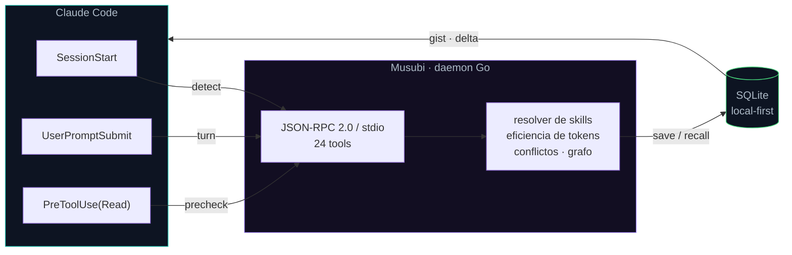
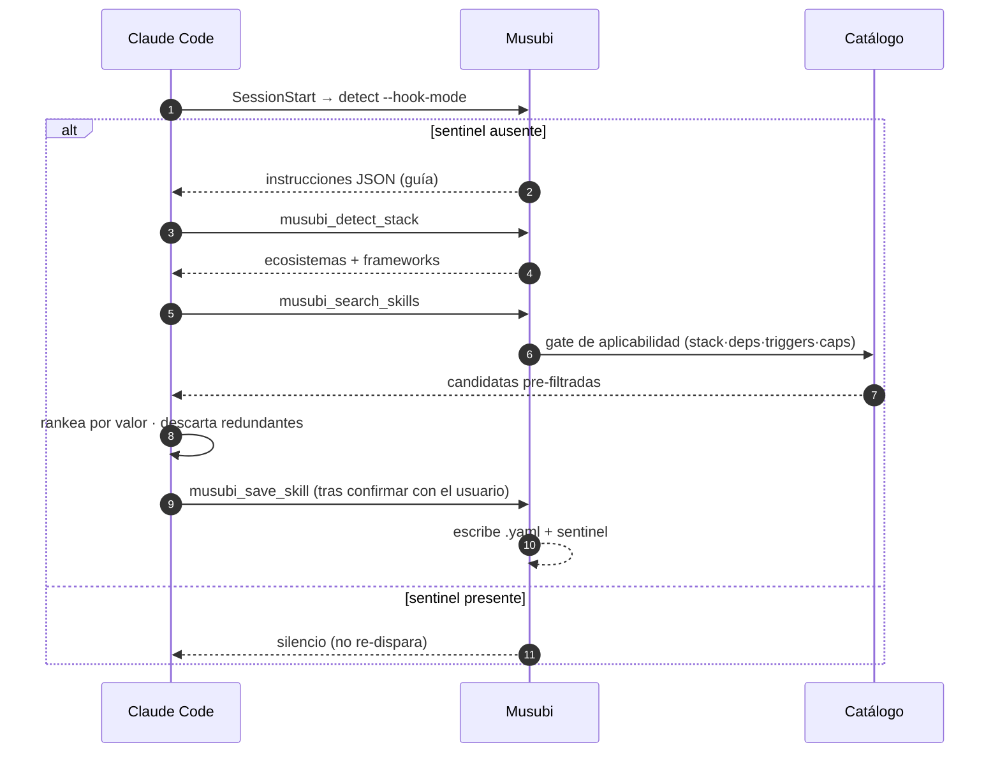
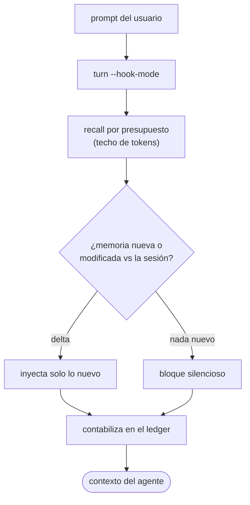

<div align="center">


<h1>Musubi</h1>

<p><strong>Memoria persistente para agentes de IA · servidor MCP en Go · local-first &amp; model-free</strong></p>

[](https://github.com/codeabraham16/musubi/actions/workflows/ci.yml)
[](https://github.com/codeabraham16/musubi/releases)
[](LICENSE)
[](go.mod)
[](CHANGELOG.md)

</div>

Servidor **MCP (Model Context Protocol)** en Go que funciona como **memoria persistente para
agentes de IA** — al estilo de Engram / Gentle AI. Guarda observaciones, las recupera por
palabra clave (FTS5) o por similitud semántica, resuelve skills dinámicamente según los archivos
en juego y registra telemetría de errores.

Local-first: todo vive en una base SQLite dentro de `.musubi/`. Sin servicios externos
obligatorios; los embeddings son opcionales.

## Cómo encaja



Tres hooks alimentan al daemon; el daemon habla MCP y persiste todo en SQLite. Lo que vuelve
al agente (gist de código, contexto por turno) se mide y se inyecta como **delta** — solo lo
nuevo respecto del turno anterior.

## Requisitos

- (Opcional) [Ollama](https://ollama.com) local para búsqueda semántica.
- Go 1.26+ solo si compilás desde fuente.

## Instalación

El instalador te deja **elegir el alcance**:

- **Local al repo**: el binario queda en `<repo>/.musubi/bin/`, el `.mcp.json` apunta ahí y
  **no se toca el PATH ni la PC**. Borrás la carpeta `.musubi/` y no queda rastro. Ideal para
  probar Musubi sin "infectar" tu máquina.
- **Global**: el binario va al PATH del usuario (sin admin); después usás `musubi setup` en
  cualquier otro repo.

### Doble clic (Windows, sin terminal) — recomendado

Descargá **`install.bat`**, copialo en la raíz de tu repo y hacé **doble clic**. Te pregunta
`[L]` local o `[G]` global, baja el binario de la última release y deja todo listo.

### Una línea (interactivo: pregunta local/global)

Windows (PowerShell):

```powershell
irm -useb https://raw.githubusercontent.com/codeabraham16/musubi/main/scripts/install.ps1 | iex
```

Linux / macOS:

```bash
curl -fsSL https://raw.githubusercontent.com/codeabraham16/musubi/main/scripts/install.sh | bash
```

No interactivo (elegís el alcance por variable):

```powershell
$env:MUSUBI_SCOPE='global'; irm -useb .../scripts/install.ps1 | iex   # o 'local'
```
```bash
curl -fsSL .../scripts/install.sh | MUSUBI_SCOPE=local bash           # o global
```

Variables reconocidas por el instalador: `MUSUBI_SCOPE` (local|global), `MUSUBI_DIR` (carpeta
del proyecto), `MUSUBI_NOSETUP=1` (no correr setup), `MUSUBI_BINARY` (usar un binario ya
descargado en vez de bajarlo).

> Repo privado: para que la descarga anónima funcione, las releases deben ser accesibles
> públicamente. Si el repo es privado, instalá [gh CLI](https://cli.github.com) y autenticate
> (`gh auth login`) — el instalador usa `gh` como fallback.

> `musubi-setup.bat` sigue disponible para el caso "ya tengo el binario y solo quiero correr
> `setup` en este repo" (no instala nada, solo prepara el entorno).

### Desde fuente

```bash
go build -o musubi ./cmd/musubi
```

## Uso rápido: inyectar en un proyecto

Un solo comando deja cualquier proyecto listo con Musubi:

```bash
cd mi-proyecto
musubi setup
```

`musubi setup` inyecta todo de punta a punta:

- Crea el workspace `.musubi/` (config + base de datos) en el proyecto.
- Escribe un skill de arranque en `.musubi/skills/`.
- Genera/mergea `.mcp.json` en la raíz, de modo que **Claude Code carga el servidor
  `musubi` automáticamente** al abrir el proyecto (con su propia memoria vía `MUSUBI_HOME`).
- Inyecta un **hook `SessionStart`** en `.claude/settings.json` para el auto-descubrimiento
  de skills (ver sección siguiente).
- Agrega `.musubi/memory.db` al `.gitignore`.

Reabrí el proyecto en Claude Code y las herramientas `musubi_*` quedan disponibles. Es
idempotente: respeta `.mcp.json`, skills, `.gitignore` y `.claude/settings.json` existentes.

## Auto-descubrimiento de skills

Al abrir el proyecto por primera vez en Claude Code, Musubi detecta automáticamente el
stack tecnológico y genera skills personalizadas sin que debas escribir YAML manualmente.



**Flujo completo:**

1. `musubi setup` inyecta en `.claude/settings.json` un hook `SessionStart` que ejecuta
   `musubi detect --hook-mode` al inicio de cada sesión.
2. Al abrir el proyecto, Claude Code ejecuta ese hook. Si el sentinel
   `.musubi/skills/.skills-generated` **no existe**, el hook emite instrucciones JSON
   que Claude recibe como contexto adicional.
3. Claude llama a `musubi_detect_stack` (detecta ecosistemas y frameworks inspeccionando
   manifests: `go.mod`, `package.json`, `Cargo.toml`, etc.).
4. Claude llama a `musubi_search_skills` para obtener candidatas del catálogo curado,
   ya pre-filtradas por relevancia técnica (stack, deps y triggers). Evalúa valor, rankea
   y descarta las redundantes con skills existentes.
5. Claude investiga la documentación **oficial** del stack detectado (`pkg.go.dev`,
   `react.dev`, `docs.python.org`, etc.) y sintetiza reglas. Para skills del catálogo,
   descarga `rules_url` para obtener las reglas completas.
6. Claude **confirma las reglas con el usuario** antes de guardar.
7. Por cada skill aprobada, Claude llama a `musubi_save_skill`, que escribe el archivo
   `.musubi/skills/{name}.yaml` y el sentinel. A partir de ahí el hook es silencioso
   (no vuelve a disparar hasta que borres el sentinel).
8. (Opcional) Claude registra sus decisiones sobre las candidatas del catálogo llamando a
   `musubi_log_skill_decision` (accepted / rejected con razón).

**Para regenerar las skills:** borrar `.musubi/skills/.skills-generated` y reabrir
el proyecto.

## Sourcing de skills (catálogo)

Musubi incluye un catálogo curado de skills que Claude consulta automáticamente para
proponer reglas relevantes para tu proyecto.

### Cómo funciona

1. Al inicio del flujo de auto-descubrimiento, Claude llama a `musubi_search_skills`
   (sin parámetros). Musubi descarga el catálogo, aplica un **gate de aplicabilidad duro**
   y devuelve solo las candidatas que pasan los cuatro filtros:
   - **Stack**: el ecosistema de la entrada coincide con el stack detectado (`Go`, `Node.js`, `Python`, etc.).
   - **Deps**: si la entrada tiene deps declaradas, al menos una está presente en los manifests del proyecto.
   - **Triggers**: al menos un archivo del proyecto coincide con los globs de la entrada.
   - **Capabilities**: todas las herramientas declaradas en `capabilities` están en el PATH.
2. Claude evalúa el **valor** de cada candidata (no la relevancia — eso lo hizo el gate).
   Ordena por valor, descarta las redundantes con skills ya guardadas.
3. Para las skills seleccionadas, Claude descarga `rules_url` para leer las reglas completas.
4. Claude confirma las rules con el usuario antes de guardar con `musubi_save_skill`.

### Configuración

Las claves de sourcing viven en `.musubi/config.yaml`:

```yaml
sourcing:
  enabled: true                   # activar / desactivar el sourcing
  catalog_url: https://raw.githubusercontent.com/codeabraham16/musubi/main/catalog/index.json
  max_candidates: 20              # máximo de candidatas retornadas por musubi_search_skills
  cache_seconds: 3600             # reservado para futura caché persistente
```

Para apuntar a un catálogo propio:

```yaml
sourcing:
  catalog_url: https://raw.githubusercontent.com/mi-org/mi-repo/main/catalog/index.json
```

El catálogo debe ser un JSON con el esquema `{ "catalog_version": 1, "entries": [...] }`.
Ver `catalog/index.json` en este repositorio como referencia.

### Catálogo incluido

El repositorio incluye un catálogo seed en `catalog/index.json` con entradas para los
stacks más comunes: Go, React, Next.js, Vue, Express, TypeScript, Python, Django,
FastAPI, Rust y Docker. Cada entrada apunta a la documentación oficial del ecosistema.

## Uso manual

```bash
# Inicializar solo el workspace (crea .musubi/ con config.yaml y memory.db)
musubi init

# Detectar el stack del proyecto (imprime JSON en stdout)
musubi detect

# Modo hook interno (usado por Claude Code al iniciar sesión)
musubi detect --hook-mode

# Arrancar el daemon MCP sobre stdin/stdout
musubi daemon

# (Opcional, gratis) Calibrar el estimador de tokens contra count_tokens
musubi calibrate            # diagnóstico
musubi calibrate --apply    # persiste los divisores ajustados a tu corpus
```

`musubi detect` inspecciona el directorio actual (o `MUSUBI_HOME`) y devuelve un JSON con
los ecosistemas y frameworks detectados. Es de solo lectura: no crea ni modifica archivos.

`musubi detect --hook-mode` es el modo que Claude Code invoca automáticamente al abrir el
proyecto. Si el sentinel `.musubi/skills/.skills-generated` existe, no produce output (silencioso).
Si no existe, emite el JSON de guía para que Claude inicie el flujo de auto-descubrimiento.

`musubi daemon` habla JSON-RPC 2.0 por stdin/stdout, listo para conectarse como servidor MCP
desde Claude Code, Cursor u otro cliente. Respeta la variable de entorno `MUSUBI_HOME` para
fijar el directorio del workspace (por defecto, el directorio actual).

## Configuración (`.musubi/config.yaml`)

```yaml
version: "1.0"
mode: local
skills_auto_resolve: true
embedding:
  provider: none          # none | ollama | openai
  model: nomic-embed-text
  base_url: http://localhost:11434
  dimensions: 768
  api_key_env: OPENAI_API_KEY   # nombre de la env var con la API key (solo openai)
```

- `provider: none` (por defecto): la búsqueda semántica queda desactivada y `musubi_search_semantic`
  responde con un error explícito sugiriendo usar la búsqueda por palabra clave.
- `provider: ollama`: el servidor genera embeddings llamando a Ollama
  (`POST {base_url}/api/embeddings`). Los agentes pasan **texto**, no vectores.
- `provider: openai`: usa la API de OpenAI o **cualquier servidor compatible** con su
  esquema (LM Studio, vLLM, LocalAI, Together…) vía `POST {base_url}/embeddings`. La API
  key se lee de la env var nombrada en `api_key_env` (default `OPENAI_API_KEY`) — **nunca
  se guarda en el yaml**.

Para activar embeddings con Ollama (local, sin API key):

```bash
ollama pull nomic-embed-text
# editar .musubi/config.yaml -> embedding.provider: ollama
```

Para activar embeddings con OpenAI:

```bash
export OPENAI_API_KEY=sk-...
# en .musubi/config.yaml:
#   embedding.provider: openai
#   embedding.model: text-embedding-3-small
#   embedding.dimensions: 1536
```

Para un servidor local compatible con OpenAI (sin tocar la nube), dejá `provider: openai`
y apuntá `base_url` a tu servidor (ej. `http://localhost:1234/v1`). Si no exige
autenticación, la env var puede quedar vacía.

## Eficiencia de tokens (model-free)

Musubi mide y minimiza cuántos tokens inyecta en el contexto del agente. Todo el
núcleo es **automático, local y offline** — no requiere API key ni gasta dinero:




- **Estimador por tipo de contenido**: calcula el costo en tokens clasificando el
  texto (prosa / código / JSON) con divisores calibrados, sesgado a no subcontar
  los payloads densos. Corre solo en cada guardado y recall.
- **Recall por presupuesto**: cada recuperación devuelve *gists* dentro de un techo
  de tokens; el contenido completo se hidrata aparte y también con tope.
- **Inyección diferencial (delta)**: por turno se inyecta **solo la memoria nueva o
  modificada** respecto de lo ya inyectado en la sesión, en vez de repetir todo cada
  turno. Ahorra tokens y evita "ensuciar" el contexto. Se reinicia al arrancar la
  sesión (o tras una compactación). Configurable con `loop.delta_injection` (default `true`).
- **Ledger de tokens por sesión**: el server contabiliza lo inyectado por superficie
  (priming de arranque + recall por turno + hidratación). Lo inspeccionás con la
  herramienta `musubi_tokens` (`action: status | reset`).

### `musubi calibrate` — opcional y gratis

El estimador trae divisores calibrados de fábrica que funcionan bien sin tocar nada.
Si querés afinarlos a tu corpus real, `musubi calibrate` los mide contra el endpoint
**`count_tokens` de Anthropic**:

- **Es gratis**: `count_tokens` *cuenta* tokens, no genera texto (no hay inferencia de
  un modelo), y Anthropic **no lo factura**. No hay costo por token.
- **Es opt-in**: requiere una API key de Anthropic (`ANTHROPIC_API_KEY`, gratis desde
  [console.anthropic.com](https://console.anthropic.com)). Es la **única** parte de
  Musubi que hace red a Anthropic, y solo cuando vos corrés el comando a mano.
- **Es de una sola vez**: con `--apply`, los divisores ajustados quedan persistidos en
  el proyecto y se aplican automáticamente en cada arranque. No hay que repetirlo.

El **server MCP nunca llama a la API**: sigue 100% offline y model-free. Si no tenés
API key, no pasa nada — Musubi funciona completo con los divisores por defecto.

## Herramientas MCP

El servidor expone 10 herramientas:

| Herramienta | Descripción |
|-------------|-------------|
| `musubi_save_observation` | Guarda una observación (`topic_key`, `content`, `id` opcional). Si hay embeddings, indexa para búsqueda semántica. |
| `musubi_search_semantic` | Busca por similitud a partir de **texto** (`query`). Requiere proveedor de embeddings. |
| `musubi_search_keyword` | Busca por texto completo FTS5 (`query_text`). Siempre disponible. |
| `musubi_log_error` | Registra un error de compilación/test para telemetría. |
| `musubi_resolve_telemetry` | Marca un log de telemetría como resuelto (`id`). |
| `musubi_resolve_skills` | Resuelve skills activas según `modified_files` + telemetría sin resolver. |
| `musubi_detect_stack` | Detecta el stack del proyecto (ecosistemas + frameworks) inspeccionando manifests. Sin parámetros. |
| `musubi_save_skill` | Guarda una skill generada como `{name}.yaml` en `.musubi/skills/` y crea el sentinel. Requiere `name`, `triggers`, `rules`. Parámetro opcional `overwrite` (por defecto `false`). |
| `musubi_search_skills` | Descarga el catálogo de skills, aplica el gate de aplicabilidad duro y devuelve candidatas relevantes para el proyecto. Parámetros opcionales: `query` (texto libre), `stack` (filtro de ecosistema), `limit` (número máximo). |
| `musubi_log_skill_decision` | Registra la decisión de Claude sobre una candidata del catálogo. Parámetros: `skill_id` (requerido), `decision` (`accepted` \| `rejected`, requerido), `name`, `reason` (opcionales). |

## Tests

```bash
go test ./...            # suite completa
go test -race ./...      # con detector de carreras (como en CI)
```

## Arquitectura

```
cmd/musubi/        # CLI: setup, detect, init, daemon
catalog/
  index.json       # catálogo seed de skills curadas (13 entradas, docs oficiales)
internal/
  bootstrap/       # inyección: MergeMCPServer + MergeClaudeSettings (hooks)
  config/          # constantes de rutas + carga de config.yaml + SourcingConfig
  detector/        # DetectStack + ExtractDeps (manifests, mtime cache)
  embedding/       # Provider (interfaz) + Ollama + OpenAI-compatible + Noop
  logx/            # logging estructurado a stderr
  mcp/             # servidor JSON-RPC 2.0 y herramientas MCP (24 tools)
  memory/          # SQLite: observaciones, embeddings, FTS5, telemetría, skill_decisions
  skills/          # resolver dinámico de skills (triggers + capabilities + MatchGlob)
  skillsource/     # catálogo HTTP: FetchCatalog, IsApplicable, FilterCatalog
```

## Estado y roadmap

Núcleo endurecido y cubierto con tests. Diferido a propósito:

- Orquestador / motor DAG.
- Loop de auto-corrección hot-patch (telemetría → parche automático → reintento). Hoy existe el
  registro y la resolución manual de telemetría.
- Escalado del índice vectorial: la búsqueda semántica recorre todos los vectores en memoria
  (O(n)), suficiente para volúmenes de prototipo.

## Documentación

- [CHANGELOG.md](CHANGELOG.md) — historial de versiones (Keep a Changelog).
- [CONTRIBUTING.md](CONTRIBUTING.md) — setup de desarrollo, checks de CI, convenciones y flujo de release.
- [docs/MCP_SDK_Evaluation.md](docs/MCP_SDK_Evaluation.md) — por qué el server usa JSON-RPC a mano y no el SDK oficial de MCP.
- [LICENSE](LICENSE) — MIT.
