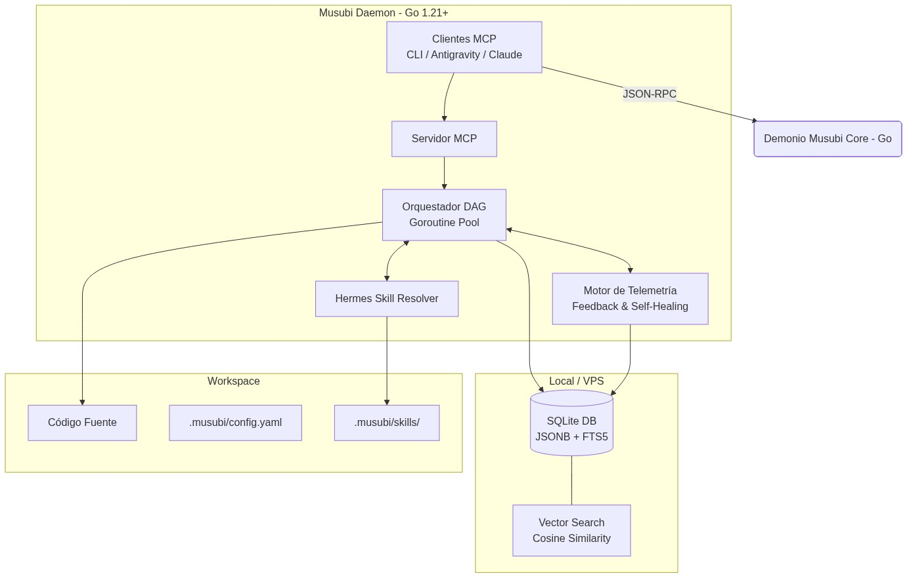
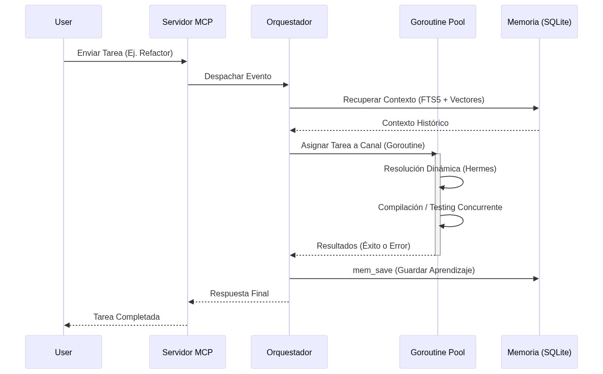
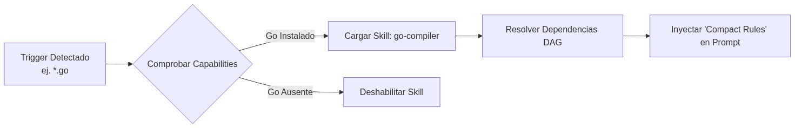

# Ecosistema Musubi: Plan de Arquitectura y Diseño

**Versión**: 1.1.0
**Estado**: Diseño Aprobado

Musubi es un ecosistema de agentes autogestionados, diseñado para ofrecer portabilidad extrema (Local/VPS/Server) y escalabilidad nativa mediante el uso del lenguaje Go (Golang), persistencia en SQLite y un motor de resolución de skills dinámico inspirado en Hermes.

---

## 1. Visión General de la Arquitectura



---

## 2. Escalabilidad y Procesamiento (Go-Native)

Para evitar el colapso bajo alta carga (como sucede con Python/Node en entornos limitados), Musubi implementa su núcleo en **Go**.



- **Goroutines & Canales**: Cada sub-agente o tarea de validación se ejecuta en su propio hilo ligero (goroutine).
- **Consumo**: El consumo basal esperado es < 20MB RAM.

---

## 3. Motor de Resolución de Skills (Hermes)



- Las skills son declarativas.
- El sistema se **autogestiona**: Si un agente comete errores frecuentes con una skill, el motor de telemetría inyecta una regla de "Hot-Patching" para reescribir temporalmente las directrices de la skill en memoria.

---

## 4. Estructura del Monorepo

```text
c:/Users/Davantis/Desktop/Musubi/
├── go.mod                      <- Definición del módulo
├── cmd/
│   ├── musubi/                 <- CLI Entry point
│   └── mcp-musubi/             <- Standalone MCP
├── internal/
│   ├── orchestrator/           <- Máquina de estados (DAG)
│   ├── memory/                 <- SQLite, FTS5 y Búsqueda Vectorial
│   ├── skills/                 <- Hermes Resolver
│   ├── telemetry/              <- Auto-corrección y Logs
│   └── mcp/                    <- Protocolo MCP
└── docs/                       <- Documentación
```

---

## 5. Decisiones de Diseño Clave

1. **Persistencia SQLite Local**: Zero configuración. La base de datos vive dentro de la carpeta del proyecto en `.musubi/memory.db`.
2. **Embeddings Locales/Remotos**: Soporte primario para un cliente HTTP a Ollama/Gemini para embeddings, con soporte opcional a ONNX local para evitar llamadas de red.
3. **Telemetría Auto-Optimizada**: Los errores del compilador o linter no se reportan solo al usuario; se analizan e ingresan a la memoria semántica para que futuras iteraciones "recuerden" cómo solucionar ese error específico.
